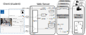

.. relab-server documentation master file, created by
   sphinx-quickstart on Fri Dec 29 10:57:17 2023.
   You can adapt this file completely to your liking, but it should at least
   contain the root `toctree` directive.

Willkommen zur ReLab-Server Dokumentation!
========================================

Dieses Repository enthält den (Web-) Hauptserver für das ReLab.

Beschreibung
-----------------------

**Allgmemeines**

Ein Remote Laboratory (ReLab) dient dazu echte Prüfstände zum Fernzugriff zur Verfügung zu stellen. Am Institut für Mechatronische Systeme wird vorlesungsbegleitend zu den Veranstaltungen Mechatronische Systeme, Robotik I und Robotik II ein ReLab ergänzend zur freiwilligen Bearbeitung angeboten.
Der Zugriff erfolgt dabei über eine eigens eingerichtete Homepage (welche in diesem Fall nur aus dem Uni-Netz heraus erreichbar ist): https://relab.imes.uni-hannover.de/.
Die Umsetzung ist examplarisch für die Lehrveranstaltung *Robotik I* in diesem `Video <https://www.youtube.com/watch?v=rsq0pxJQl0s/>`_ vorgestellt.

Das Remote Laboratory einer Lehrveranstaltung umfasst in den veröffentlichten Beispielen 4 Laborversuche, die aufeinander thematisch aufbauen. Es können die Labore jedoch in beliebiger Reihenfolge absolviert werden. Jeder Laborversuch besteht aus Aufgaben und ggf. einer „Challenge“. Letztere wird freigeschaltet, sobald die Aufgaben vollständig und richtig bearbeitet sind. In dieser bekommen die Studierenden die Möglichkeit für ihre Lösungen, deren Güte individuell bewertet und bepunktet wird, Zusatzpunkte zu erreichen, um im Ranking (auf der Hauptseite abgebildet) aufzusteigen. In der Regel werden je gelöster Aufgabe z.B. 500 Punkte vergeben und in der Challenge variable, erfolgsabhängige Punktzahlen.

Der allgemeine Ablauf eines Versuchs besteht aus:

1. Durchlesen der Anleitung,
2.  ggf. Vorbereitung des Laborversuchs,
3.  der Buchung des Versuchsstandes,
4.  dem Durchführen des Versuchs und Übermittlung aller notwendigen Daten,
5.  und ggf. dem Lösen bestimmter Aufgaben unter Verwendung von Versuchsdaten.

Abbild der Interfaces (a) Landing und Admin page (b) Startseite mit User-Ranking (c) Buchungsseite (d) Control Interface während des Laborversuchs:

.. image:: Interfaces.svg
    :target: _images/Interfaces.svg

**Software**

Das Remote Laboratory verteilt sich über mehrere Server. Der Hauptserver ist der zentrale Anlaufpunkt und stellt alle Inhalte, die nicht direkt den Prüfstand betreffen zur Verfügung: Internetseiten, Authentifizierung, Webserver und Routing, Firewall, janus-gateway (Videoserver), MySQL Nutzerdantebank, Firewall.
Daneben wird für jedes ReLab einen Application-Server erstellt, welcher die Kommunikation mit dem Prüfstand übernimmt.

Visualisierung der Kommunikationsstruktur:

Auf den Applicationservern erfolgen nur die direkten Interaktionen mit dem Versuchsstand (Speicherung von Messdaten, Starten von Bewegungen, Überprüfung von Lösungen) sowie die Erzeugung des RTP-Video-Streams (dieser wird anschließend an janus-gateway gesendet. Die Kommunikation zwischen dem Hauptserver und den Application-Servern teilt sich in die drei Bereiche:

- Routing (Weiterleitung von nginx),
- VideoStream
- und lesenden sowie schreibenden Zugriff auf die MySQL-Nutzerdatenbank auf dem Hauptserver.

Die Application-Server können auf dem gleichen PC wie der Hauptserver laufen (Beispiel: Labor Mechatronische Systeme relab-appserver-mechsys), oder z.B. im Fall von räumlich getrennten Versuchsständen auf einem separaten PC und über das interne Netzwerk kommunizieren (Beispiel: Labor Robotik I relab-appserver-robotiki).

Die Repositories sind als Vorlage zur Erstellung eigener Labore zu verstehen. Wichtige Unterscheidungsmerkmale sind

- die Ausführung auf dem PC des Hauptservers (Mechatronische Systeme) oder auf einem separaten PC (Robotik I, Robotik II),
- die Kommunikation zum Prüfstand via UDP (Mechatronische Systeme, Robotik II) oder OPC-UA,
- sowie zur Ansteuerung des Prüfstands die Nutzung einer Industriesteuerung (Robotik I) oder eines Target-PCs mit Simulink Real-Time Kernel (Mechatronische Systeme, Robotik II).

Verwendetes Setup
--------------------------

Software
^^^^^^^^^
- Webserver: LEMP stack (Linux, nginx, MySQL, Python)

  - webserver engine: nginx
  - Webframefork: flask
  - template engine: jinja2
  - Datenbank: MySQL
- Videostream: Janus WebRTC Server

Hardware
^^^^^^^^^
- PC Dell Optiplex 7040

.. toctree::
   :caption: Einrichtung und Verwendung:
   :titlesonly:

   requirements
   installation
   usage

Verzeichnisstruktur
------------------------

Die Verzeichnisstruktur sollte nach vollständiger Einrichtung wie folgt aussehen:

.. parsed-literal::

    /var/www/server
    ├── app                   # Python Hauptanwendungen
    │   ├── config
    │   ├── db_client         # Verbindung mit Datenbank nach User input
    │   └── templates         # html templates
    ├── db_server             # manuelle, serverseitige DB Funktionen
    ├── docs
    ├── server                # Webserver Configs
    │   └── autostart
    ├── static                # vom Webserer bereitgestellte, statische Dateien
    │   ├── css
    │   ├── files
    │   ├── fonts
    │   ├── html
    │   ├── img
    │   └── js
    ├── vassals               # Configs uwsgi vassals
    ├── venv
    └── video                 # Videostream

Read The Docs Anleitung erstellen
-------------------------------------
Nach Durchführung aller oben genannten Schritte kann eine html Read The Docs Anleitung mit sphinx erstellt werden. Die venv muss aktiv sein.

.. code-block:: console

    cd docs
    make html

Die Anleitung kann über die Datei index.html in einem beliebigen Browser geöffnet werden.

.. toctree::
   :maxdepth: 4
   :caption: Module und Funktionen:

   modules

Indizes Tabellen
-----------------

* :ref:`genindex`
* :ref:`modindex`
* :ref:`search`
